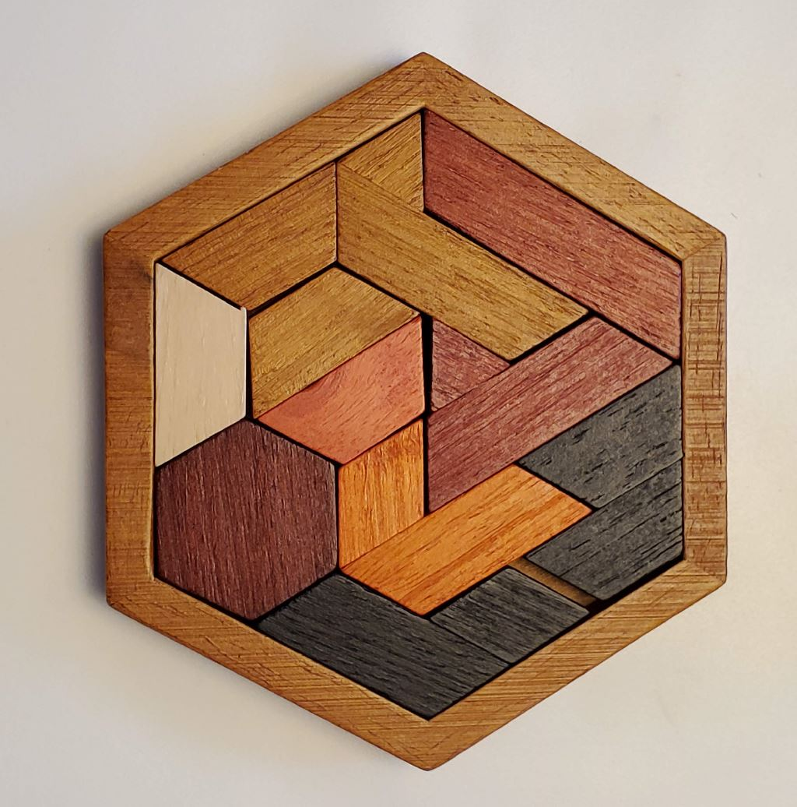

# Tangram Puzzle Image Analyzer & Generator

A [Tangram](https://en.wikipedia.org/wiki/Tangram) is a "dissection puzzle"
composed of a number of flat wooden pieces which are assembled to form a specific
shape.

This project deals with a variant called **11 pieces hexagon tangram jigsaw**.  
Whereas a traditional tangram has only 7 pieces, this variant of the puzzle,
as the name indicates, uses 11 pieces which fit in an enclosing hexagon.
There are actually 8 shapes of pieces, and 5 different colors.

This project contains 4 sub-projects:
  * Board Image Analyzer
  * Board Generator
  * Web Viewer
  * Pieces Statistics

## Board Image Analyzer

The analyzer was built to determine whether our puzzle solutions were unique
or contained duplicates.

The analyzer is a command-line Python program that processes
images of the real puzzle board using
[OpenCV-Python](https://docs.opencv.org/4.x/index.html) and
outputs a table that lists all the pictures of the boards and their
identified cells colors, listing duplicates when found.

The image analyzer is experimental and has a few shortcomings.

More information is available in the [analyzer](analyzer/) directory.

## Board Generator

One of the early questions we had about this puzzle is how many possible solutions
there are.

We do not know of a way to mathematically compute the number of valid solutions.
This prompted the idea of writing a generator that would compute all the possible moves
to find the number of possible board solutions.

There are 2 versions of the generator in this project:
* [analyzer/gen.py](analyzer/gen.py) is the
  original version written in Python. It initially computed permutations at the speed of
  one every 10 seconds, and was further optimized using various heuristics to compute
  10 permutations per second.
* [rgen](rgen/) is a rewrite of the generator
  in Rust. It uses the same heuristics. This one computes about 500 permutations per second
  per thread on the laptop. Running it on 4 threads, it covered the 160 million permutations in
  about 24 hours.

More information on the generator is also available in [web/intro.md](web/src/intro/intro.md).

## Pieces Statistics

The [analyzer/pieces_stats.py](analyzer/pieces_stats.py) component of the analyzer
takes the list of all board solutions computed by the [generator](#board-generator)
and analyze how each piece is used:
  * For pieces that have variants in chirality or rotation, we're interested in
    computing if one variant is more prominent across all solutions. The expectation
    is that they should have equal distribution.
  * A "heat map" is computed for each piece by counting the number of times each cell
    on the board is used across all solutions. This would tell us where a piece is
    more likely to be placed on a given board.

## Web Viewer

Web viewer is a React-TypeScript single page application that displays the results
of the generator, the board analyzer, and the pieces statistics.

The source is located in the [web](web/) directory.

**The web viewer is deployed at https://www.alfray.com/labs/apps/tangram/**  
Just head over there to see the results of this project.

## License

MIT. See [LICENSE](/LICENSE).

~~
