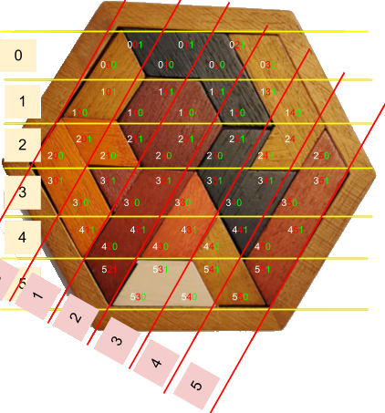

# Tangram Puzzle Image Analyzer

This analyzer attempts to parse pictures of a
[Tangram Puzzle](data/originals/sample/sample.jpg).

<p align=center></p>

The analyzer was built to determine whether our puzzle solutions were unique
or contained duplicates.

The analyzer is a command-line Python program that processes
images of the real puzzle board using
[OpenCV-Python](https://docs.opencv.org/4.x/index.html) and
outputs a table that lists all the pictures of the boards and their
identified cells colors, listing duplicates when found.

The image analyzer is experimental and has a few shortcomings.


## Implementaton and Limitations

The overall process is to attempt to find the hexagon board in the image,
rotate it to have a consistent orientation of all the boards, then try to
identify the color of each cell using color sampling.

The implementation uses [OpenCV-Python](https://docs.opencv.org/4.x/index.html) to load images,
manipulate them, and access their color channels.

The first step is detecting the boundaries of the hexagon board.
All input images are resized to a max size of 1024px.
The input image is then converted to
[L*a*b* ](https://en.wikipedia.org/wiki/CIELAB_color_space)
to extract the luminance channel.
A slight gaussian blur is applied, followed by some basic brightness
normalization, and grayscale quantization.
The result of that is run through a
[Canny edge detection](https://docs.opencv.org/4.x/da/d22/tutorial_py_canny.html)
algorithm.
[OpenCV findContours](https://docs.opencv.org/4.11.0/df/d0d/tutorial_find_contours.html)
is used to process the edges, and the result of that is further filtered
before being processed by
[OpenCV approxPolyDP](https://docs.opencv.org/4.x/dd/d49/tutorial_py_contour_features.html).
The edge filter process is customized to match the fact we want to detect
straight lines broken at 60 degrees angles.

An iterative process is used -- several combinations of blur parameters,
brightness adjustments, and edge thresholds are attempted till we get a shape
that actually has 6 sides.

All this processing is highly dependent on having a clear separation between
the board and its background. Furthermore, shadows can alter the perceived
outline of the board, distorting the hexagon.

The next step is rotating the image such that the bottom of the hexagon be
flat. This is simply done by identifying the center of the polyon as well as
the lowest hexagon segment, and rotating the image for this to be horizontal.

We try to account for image distortion in two ways.

First we can treat the hexagon has having points on a circle.
Once the center of the hexagon is determined by averaging its points, we
remap each hexagon point using polar coordinates and compute a radial
distortion factor for each angle multiple of 60 degrees.

Second, we use two of the opposing sides of the hexagon (top and down) as a
normalized Y vector. The next adjacent side of the hexagon gives us an X
vector. Instead of assuming that the unit vector has a pure idealized size of
(1, 1), that is adjusted to match the points of the polygon.

The puzzle board is composed of equilateral triangle cells.
We define each cell as having a coordinate in a pseudo "YRG coordinate system"
defined as follows:
  * Y matches the vertical Y in the XY pixel coordinate system.
  * R is similar to X but skewed by a 30 degree angle.
  * This transforms the unit rectangle into a rhombus shape,
    which is divided in 2 to form each triangle cell on the board, and given
    the pseudo coordinate of G=0 vs G=1 for each triangle in each rhombus.

<p align=center></p>

Once that "YRG coordinate system" has been mapped on the image using the
computed hexagon center and the hexagon radial distortion as explained above,
we can proceed in determining the color of each cell.

For each cell, we sample the center of the triangle cell and then use some
heuristics:
  * The L channel of the L*a*b* image is used to determine the white cells.
  * The a* channel of the L*a*b* image is used to detect both black,
    excluding the white cells already found.
  * The R channel in RGB is combined with the L channel in L*a*b* to identify
    the orange, yellow, and red cells.

To minimize noise, the sampling above is not done on the entire image.
Instead, it is performed only on a small rectangular section in each cell.
Once some colors have been determined, they are excluded from further
sampling evaluation to minimize noise.


## Usage

1. Place all source pictures in `analyzer/data/originals`.
2. Create the destination directory:
```shell
$ mkdir analyzer/data/output
```
3. Run the generator:
```shell
cd analyzer
python main.py -d data/originals/
```
4. Open the generate index: \
[data/output/index.html](analyzer/data/output/index.html)


To run the generator on a different source and destination directories:
```shell
python main.py --input-dir path/to/sources/ --output-dir path/to/output/dir
python main.py          -d path/to/sources/           -o path/to/output/dir
```
The command above scans the input directory _recursively_ for all files matching `*.jpg`.
Once all the files have been processed, an `index.html` is generated listing all the results.

Each parameter has a long and a short form (e.g. `-d` and `--input-dir`).

The default output directory, if not provided, is `analyzer/data/output`.

It's also possible to process a single image at a time:
```shell
python main.py --input-image path/to/image.jpg --output-dir path/to/output/dir
python main.py            -i path/to/image.jpg           -o path/to/output/dir
```

Inputs are only processed once. To force inputs to be processed again, use the `-y`
or `--overwrite` argument:

```shell
python main.py -d data/originals/ --overwrite
python main.py -d data/originals/  -y
```


## Build Requirements

This requires Python 3 with the
[OpenCV-Python library](https://docs.opencv.org/4.x/d6/d00/tutorial_py_root.html).


Windows using Python for Windows (standalone or via Git Bash):
```shell
$ python -m venv .venv
$ source .venv/Scripts/active
$ python -m pip install --upgrade pip
$ pip install -v opencv-python
```

The method above is the official way to install OpenCV-Python on Windows.
The methods explain below can be... tedious, at best.


Windows with Cygwin or MSYS have their own packages which may or may not build easily:
```shell
# Cygwin Setup: requires make, cmake, gcc, python3-pkgconfig, python3-cv2, python3-devel
$ pip install --verbose opencv-python

# MSYS:
$ pacman -S cmake gcc mingw-w64-x86_64-python-opencv
```

Linux:
```shell
$ apt install python3-opencv
```


## License

MIT. See [LICENSE](../LICENSE).

~~
